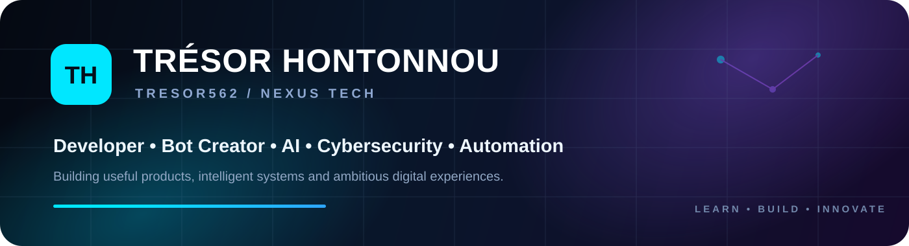

<div align="center">
  
</div>

<br/>

<div align="center">
  <a href="https://git.io/typing-svg">
    
  </a>
</div>

<div align="center">
  <a href="https://github.com/Tresor562"></a>
  <a href="https://github.com/Nexus-tech-01"></a>
  <a href="https://tresor562.github.io"></a>
  <a href="https://t.me/tresor20001"></a>
</div>

<div align="center">
  
</div>

---

## 👨‍💻 About Me

```js
const tresor = {
  name: "Trésor HONTONNOU",
  username: "Tresor562",
  country: "Benin 🇧🇯",
  organization: "Nexus Tech",
  roles: [
    "Web Developer",
    "Bot Creator",
    "AI Builder",
    "Cybersecurity Learner",
    "Entrepreneur"
  ],
  focus: [
    "Artificial Intelligence",
    "Cybersecurity",
    "Automation",
    "Web & Mobile Products",
    "Bots & APIs",
    "Computer Engineering"
  ],
  currentMission: "Build useful, ambitious and intelligent digital products.",
  motto: "Learn. Build. Innovate. Evolve."
};
```

I build web platforms, bots, automation systems and AI-oriented products. I am developing the **Nexus Tech** ecosystem around software, artificial intelligence, cybersecurity, learning and collaborative technology projects.

---

## 🌍 Localisation

<div align="center">
  
  
</div>

---

## 🛠️ Tech Stack

<div align="center">


</div>

---

## 📊 GitHub Stats

<div align="center">
  
  
</div>

<div align="center">
  
</div>

<div align="center">
  
</div>

---

## 🏆 GitHub Trophies

<div align="center">
  
</div>

---

## 🚀 Featured Projects

<table>
<tr>
<td width="50%" valign="top">

### 🧠 NexCode
Interactive and gamified platform for learning programming, practicing and building real projects.

[View repository →](https://github.com/Tresor562/NexCode)

</td>
<td width="50%" valign="top">

### 🌌 The Big Dipper
WhatsApp bot ecosystem focused on automation, group tools, games and rich command experiences.

[View repository →](https://github.com/Tresor562/THE_BIG_DIPPER)

</td>
</tr>
<tr>
<td width="50%" valign="top">

### 🌐 Portfolio
Personal web presence presenting projects, skills and the Nexus ecosystem.

[View repository →](https://github.com/Tresor562/Tresor562.github.io)

</td>
<td width="50%" valign="top">

### 🧩 Dependency Atlas
Developer tooling and experimentation around software dependencies and project analysis.

[View repository →](https://github.com/Tresor562/Dependency-Atlas)

</td>
</tr>
</table>

---

## ⚡ Nexus Tech

<div align="center">
  <a href="https://github.com/Nexus-tech-01">
    
  </a>
</div>

<div align="center">
  <h3>Code with purpose. Build for impact. ⚡</h3>
  <sub>Trésor HONTONNOU • Tresor562 • Nexus Tech</sub>
</div>
