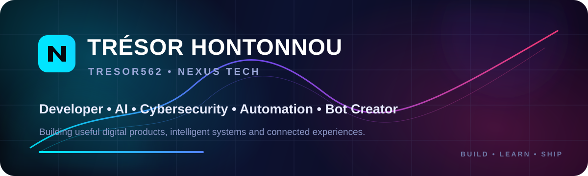

<div align="center">
  
</div>

<div align="center">
  <br />
  <a href="https://github.com/Tresor562"></a>
  <a href="https://github.com/thenexustech01"></a>
  <a href="https://tresor562.github.io"></a>
  
</div>

<br />

## 👨‍💻 About Me

```js
const tresor = {
  name: "Trésor HONTONNOU",
  username: "Tresor562",
  brand: "Nexus Tech",
  location: "Benin 🇧🇯",
  roles: [
    "Web Developer",
    "Bot Creator",
    "AI Builder",
    "Cybersecurity Learner",
    "Entrepreneur"
  ],
  interests: [
    "Artificial Intelligence",
    "Cybersecurity",
    "Automation",
    "Web Platforms",
    "Bots & APIs",
    "Computer Engineering"
  ],
  mission: "Build useful, ambitious and intelligent digital products."
};
```

I build web platforms, bots, automation tools and AI-oriented products under the **Nexus Tech** ecosystem. My long-term direction is computer engineering with a strong focus on **cybersecurity, artificial intelligence and AI systems analysis**.

---

## 🚀 Nexus Ecosystem

<table>
<tr>
<td width="50%" valign="top">

### 🧠 KnowMe
A social platform designed around discovery, challenges, games and interactions that help people know each other better.

</td>
<td width="50%" valign="top">

### ✨ Nexus AI
AI-focused product work exploring intelligent assistance, automation and useful digital experiences.

</td>
</tr>
<tr>
<td width="50%" valign="top">

### 🌌 THE BIG DIPPER
A WhatsApp bot ecosystem focused on powerful group tools, automation and rich command experiences.

</td>
<td width="50%" valign="top">

### 🛍️ Nexus Store
A distribution hub for Nexus apps, tools, games and digital products.

</td>
</tr>
</table>

---

## 🛠️ Tech Stack

<div align="center">


</div>

---

## 📊 GitHub Stats

<div align="center">
  
  
</div>

<div align="center">
  
</div>

---

## 🏆 GitHub Trophies

<div align="center">
  
</div>

---

## 📈 Contribution Activity

<div align="center">
  
</div>

---

## 🌐 Selected Public Repositories

<div align="center">
  <a href="https://github.com/Tresor562/Tresor562.github.io"></a>
  <a href="https://github.com/Tresor562/Dependency-Atlas"></a>
</div>

<div align="center">
  <a href="https://github.com/Tresor562/DevEnv-Doctor"></a>
  <a href="https://github.com/Tresor562/KiroShelf"></a>
</div>

---

<div align="center">
  <h3>⚡ Build. Learn. Secure. Innovate.</h3>
  <sub>Trésor HONTONNOU • Tresor562 • Nexus Tech</sub>
</div>
